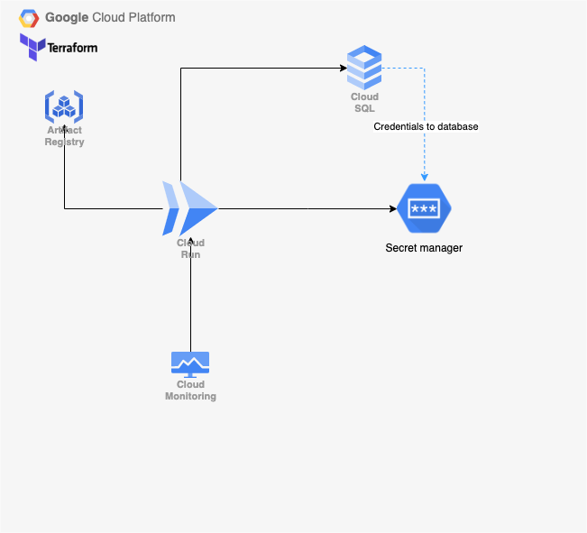
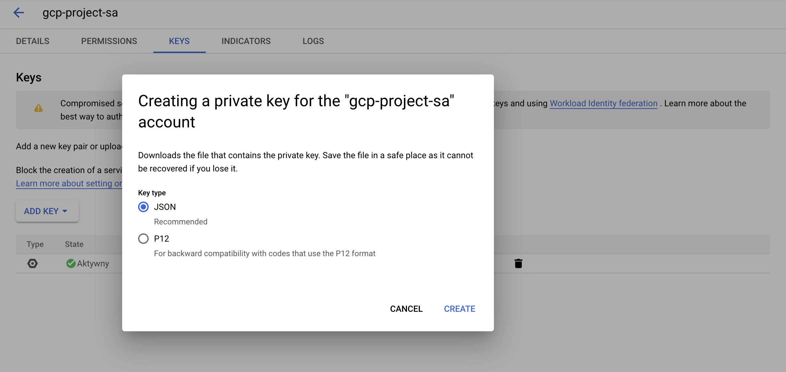
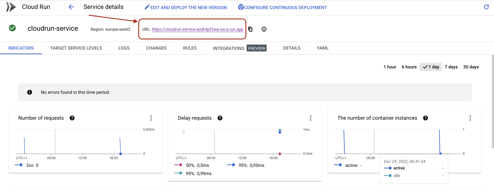
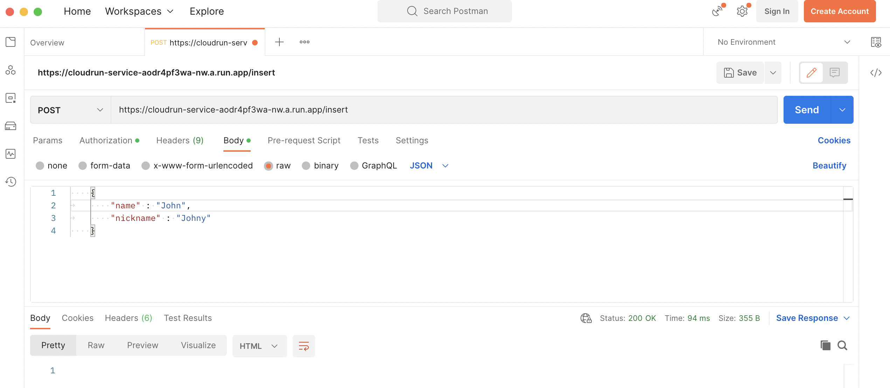
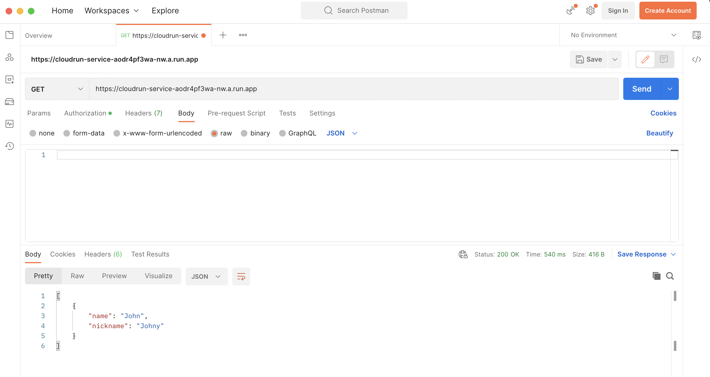
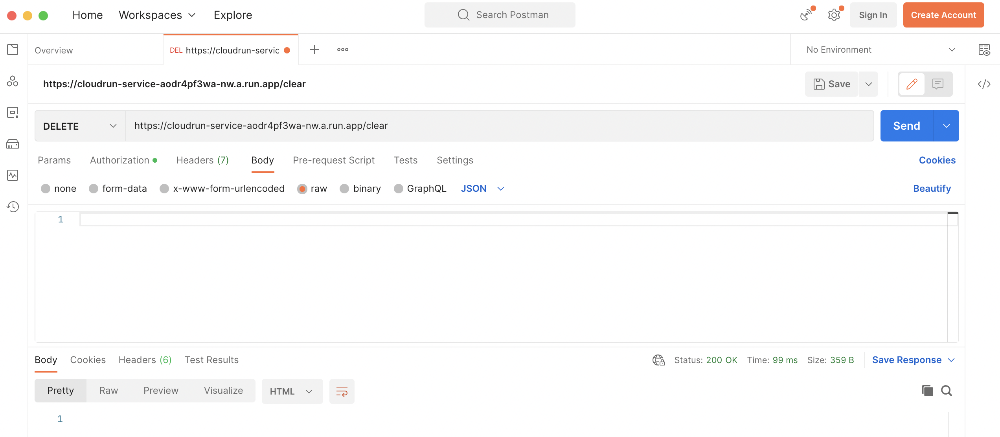

## Google Cloud Platform - Sabre project
## Architecture

The goal of project is to make several GCP services work together. 

The services that will be used in the project are:
* Clour Run  
  Cluster run will be used for deploying and maintaining application. It will make use of deployment and secret.
  The application is simple Go application posting and retrieving data from database.
* Cloud SQL  
  It will provide SQL database to store data for application use.
* Artifact registry
  It will store Docker image of application. Bulding image and pusging it to artifact repository is done in `docker_script.sh`.
* Google Secret Manager  
  Secret manager will create secrets with database credentials.
* Cloud Monitoring  
  Creates alerts for database and container CPU.

## Prerequisites
* Installed Terraform and Docker.

## Instruction

 1. Get config json for your service account
	Go to Service Accounts and choose or create your service account, go to `Keys` tab and `Add key`, `Create Key` and `Json type`, it will download config.
	
 2. Change variables in Terraform
	Go to variables.tf and change variable `config_json_path` to absolute path to the file where you stored json config for your service account, that you've downloaded in previous step. `project` to your project-id, `region` to gcp region, where you want your resources stored, `email` to email, that will be notified when CPU usage of database or app container is above 80%.
	
 3. Run `terraform init` to initilize Terraform.
 4. Run `terraform apply` and type in yes to provision all gcp components.
 5. Then you can access app by going to GCP console, go to Cloud Run and choose your app instance and copy app link, and open for example Postman to make a call to app.
 
 6. In Postman choose POST type of call, paste the app link, add suffix `/insert` and in body paste: 
	 

    {
	    "name" : "John"
	    "nickname" : "Johny"
    }
    
	and click `Send`.
  
 7. Then make a GET call to get a list of persons in database (body has to be empty).
  
8. **IMPORTANT!** before deleting resource make a DELETE call and and to path `/clear` to delete all associations in database, otherwise `terraform destroy` will fail.

9. To delete all resorces run `terraform destroy`.